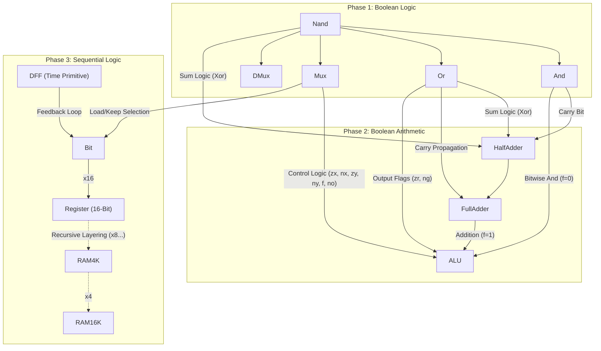

# NAND2Tetris: A 16-bit General Purpose Computer

> A "First Principles" implementation of a full-scale 16-bit computer architecture, built from the NAND gate up to the Operating System.
> 


-success)

### Table of Contents

* [Overview](#overview)
* [The Silicon Substrate](#the-silicon-substrate)
* [Architecture](#architecture)
* [The ALU](#the-alu)
* [Memory Hierarchy](#memory-hierarchy)


* [The Software Stack](#the-software-stack)
* [Machine Language](#machine-language)
* [The Compiler](#the-compiler)


* [Simulation](#simulation)
* [Progress Log](#progress-log)

# Overview

If you want to use a computer, you can buy a MacBook. If you want to understand computer science, you can read a textbook.

But if you want to know what a machine is really made of, you have to build one.

Modern computing is obscured by layers of abstraction. We take the CPU, the kernel, and the compiler for granted. This project is a rejection of that "black box" mentality.

The "Hack Computer" is a general-purpose 16-bit computer constructed entirely from scratch. Every chip in this repository is derived from a single logic gate: the NAND, in a "First Principles" fashion. The goal is to lay the groundwork for future kernel and embedded systems development (specifically Ring-0 development) by demystifying the stack completely.

# The Silicon Substrate

The following dependency graph illustrates the genesis of the system: from the Nand to where I currently am (both the ALU and the Memory Units).



# Architecture

The system utilizes the classic 16-bit Von Neumann architecture, integrating the CPU, RAM, and ROM via a centralized bus system. The hardware is implemented in Hardware Description Language (HDL).

## The ALU

The compute engine. It utilizes a series of `Mux16` and `Add16` gates to perform 18 different computations based on just 6 control bits:

1. zx: Zero the x input
2. nx: Negate (Not) the x input
3. zy: Zero the y input
4. ny: Negate (Not) the y input
5. f: Function code (1 for Add, 0 for And)
6. no: Negate (Not) the output

It also outputs status flags (`zr` for zero, `ng` for negative) to support branching logic in the CPU.


## The Memory

The RAM16K is a recursive hierarchy design. I constructed this by chaining `RAM4K` modules, which themselves are built from `RAM512`, down to the single Bit Register. This ensures efficient address access via `DMux` logic.


# The Software Stack

Hardware is useless without instructions. The second half of this project focuses on virtualization and compilation.

### Machine Language

The Hack platform uses a 16-bit A-instruction and C-instruction set. Below is an example of a simple loop (Sum 1 to 10) in Hack Assembly:

```asm
// Computes R0 = 1 + ... + 10
   @i     // Allocates memory for i
   M=1    // i = 1
   @sum   // Allocates memory for sum
   M=0    // sum = 0

(LOOP)
   @i
   D=M    // D = i
   @10
   D=D-A  // D = i - 10
   @END
   D;JGT  // If (i - 10) > 0, goto END

   @i
   D=M
   @sum
   M=D+M  // sum = sum + i
   @i
   M=M+1  // i = i + 1
   @LOOP
   0;JMP  // Goto LOOP

(END)
   @END
   0;JMP  // Infinite loop

```

### The Compiler

The final goal is to run a high-level Object-Oriented language called Jack. The compiler stack includes:

1. Assembler: Translates `.asm` to binary `.hack`.
2. VM Translator: Converts stack-based VM code to Assembly.
3. Jack Compiler: Tokenizes and parses high-level Java-like syntax into VM code.

# Simulation

Every chipset made here has passed all hardware simulation tests in the course-provided Hardware Simulator.

To run the HDL simulations:

1. Clone the repo.
2. Load the `.hdl` files into the [Nand2Tetris Web IDE](https://nand2tetris.github.io/web-ide/chip/).
3. Load the corresponding test script `.tst`.
4. Run the simulation.

# Progress Log

### I. Hardware Layer (The Silicon)

* [x] **Project 1:** Boolean Logic (Nand, And, Or, Mux, DMux)
* [x] **Project 2:** Boolean Arithmetic (HalfAdder, FullAdder, ALU)
* [x] **Project 3:** Sequential Logic (DFF, Bit, Register, RAM8/64/4K/16K)
* [ ] **Project 4:** Machine Language <--- Currently here
* [ ] **Project 5:** Computer Architecture (CPU & Memory Mapping)

### II. Software Hierarchy (The Virtualization)

* [ ] **Project 6:** The Assembler
* [ ] **Project 7/8:** VM Translator (Stack Arithmetic & Control Flow)
* [ ] **Project 9:** High-Level Language (Jack) Application
* [ ] **Project 10/11:** The Compiler (Syntax Analysis & Code Gen)
* [ ] **Project 12:** The Operating System (Math.jack, Screen.jack, etc.)

---

*powered by logic, coffee, and many sleepless nights*
